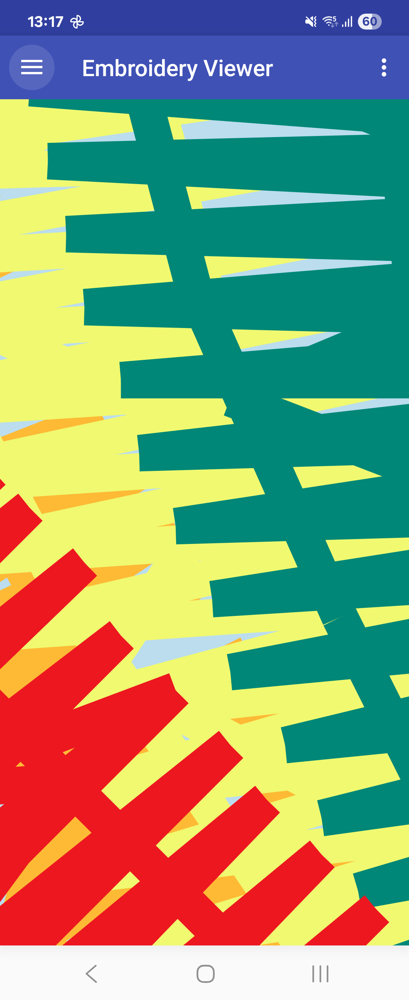
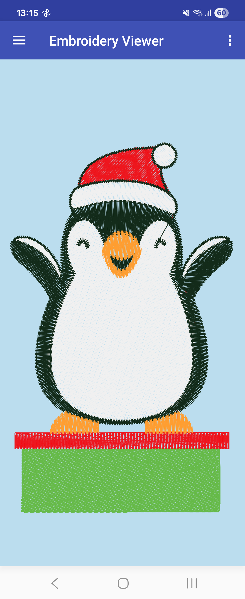

# Mobile Embroidery Viewer

View and tweak machine embroidery files on your Android device.

Original source by https://github.com/Embroidermodder/EmbroideryMobile

Current features
----------------

Ability to view .DST,.EXP, .JEF, .PCS, .PEC, .PES, .SEW, and .XXX designs.

 
Screenshots
-----------

  
 

Planned features (no particular order)
--------------------------------------
- [x] Librariefy
- [ ] Kotlinify
- [ ] Distributify

Happy embroidering!
